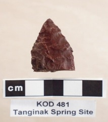

# Resume
>
>**Graduate Student:** Rene Burk, burkr@oregonstate.edu | **Office Hours:** M 1100 - 1700 or by appt. @WLKN 217
>MAIS Masters of Arts &  Interdisciplinary Studies Program
>Disciplines in Botany and Plant Psysiology, Anthropology (Archaeology), and Geography
>
>
>
>
# H1 Rene Burk

PO Box 1775, Corvallis, OR 97339

(503) 601-9793

mail to: burkr@oregonstate.edu

Online Network: https://www.linkedin.com/in/rene-b

# H2 Summary

Due to my experience in this field, I would be an excellent candidate for this position.

# H3 Work Experience

H4 ARCHAEOLOGICAL EXPERIENCE:

Bureau of Land Management, Roseburg-Salem District Office, OR
Archaeologist-Contractor 2018-Present
Digitizing documents, field work, OCRIS training and use.

Historical Research Associates, Seattle, WA & Portland, OR
Archaeological technician-Intermittent 2007-2017
Conducting fieldwork, surveys, monitoring in Washington, Oregon and Idaho.

Cascadia Archaeology, Randall Schalk, Ph.D.
Field technician/office assistant-Intermittent 2000-2012
Performed lab work sorting aggregate, office tasks, proofreading, and survey.
Upon graduation, I performed excavations, laboratory sorting, surveys, and monitoring.

Brian Smith and Associates, San Diego, CA
Laboratory Technician- November 2009
Assisted crew in the recovery of the 1945 workers’ camp at Hanford Nuclear Reservation. Sorted and dried artifacts in the field laboratory.

## H3 Education

* [University 1] 2017: Oregon State University, Corvallis, OR
Currently Enrolled as of Fall 2017

* [University 2] 2003: University of Washington, Seattle, WA
Bachelors of Art in Anthropology with emphasis in Archaeology

* [University 3] 2001 Central Washington University, Seattle, WA
Archaeological Field School,  Mount Rainier National Park

* [University 4] 2001: Central Washington University,
Archaeological Field School,  Mount Rainier National Park

## H3 *[University 1]: https://oregonstate.edu/
*[University 2]: https://www.washington.edu/
*[University 3]: https://www.burkemuseum.org/
*[University 4]: https://www.cwu.edu/

| Supplemental  | Table  |
|-------------- |-------|
| My Photography Webpage  |https://www.shutterstock.com/g/Rene834 |
| Photography Lithics Lab  | |
| Emojis                  | 🥾🎓👢⛏🚙 |

Credits: This resume template is from http://www.jasonfilley.com/resumeinmarkdown.html.
